<!-- filepath: /home/sabrina-cristan/github/thermal_plant_analysis/DEV_DOCUMENTATION.md -->
Última atualização: 09 de fevereiro de 2026

# Documentação de desenvolvimento: processamento de imagens termográficas

&nbsp;&nbsp;&nbsp;Resumo das tentativas, decisões e estado atual do projeto para extração de dados térmicos de plantas.

> Nota: as informações mais importantes do estado atual do projeto se concentram na seção 2 desse documento.

---

## Sumário

1. [Histórico de versões e explicação das mudanças](#1-histórico-de-versões-e-explicação-das-mudanças)
    - [1.1 Versão 1.0 — segmentação por cor (RGB)](#11-versão-10--segmentação-por-cor-rgb)
    - [1.2 Versão 2.0 — remoção de fundo por IA](#12-versão-20--remoção-de-fundo-por-ia)
    - [1.3 Versão 3.0 — mapeamento HSV e recorte automático](#13-versão-30--mapeamento-hsv-e-recorte-automático)
2. [Versão atual: extração de dados radiométricos](#2-versão-atual-extração-de-dados-radiométricos)
    - [2.1 Entendendo a câmera](#21-entendendo-a-câmera)
    - [2.2 Lógica de execução](#22-lógica-de-execução)
    - [2.3 Validação da ferramenta](#23-validação-da-ferramenta)
3. [Planejamento futuro](#3-planejamento-futuro)
4. [Observações finais](#4-observações-finais)
5. [Bibliografia](#5-bibliografia)

---

## 1 Histórico de versões e explicação das mudanças

### 1.1 Versão 1.0 — segmentação por cor (RGB)

<small>Sem datas de lançamento e descontinuação.</small>

> Status: essa versão foi desconsiderada por apresentar imprecisões no método de segmentação.

&nbsp;&nbsp;&nbsp;A primeira tentativa consistiu no uso de imagens visuais (RGB) para a criação de máscaras de segmentação focadas em tons de verde. A metodologia baseou-se na aplicação de limiares (*thresholding*) nos canais R, G e B para isolar a folhagem. Contudo, essa abordagem apresentou limitações significativas, pois elementos do fundo com variações de iluminação e tonalidades esverdeadas geraram falsos positivos na máscara final. Concluiu-se que a segmentação baseada apenas em intensidade de cor é insuficiente para ambientes com fundo não controlado.

| Figura 1               | Figura 2                 |
|------------------------|--------------------------|
| 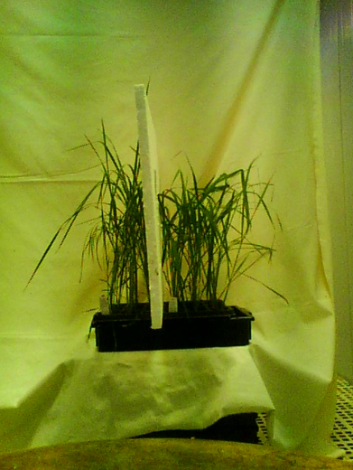 | 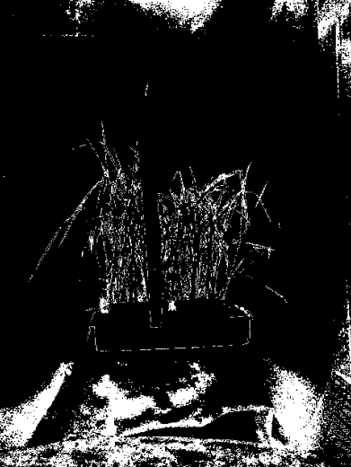 |

| Figura 3                 | Figura 4                 |
|--------------------------|--------------------------|
| 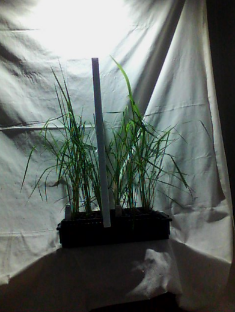 | 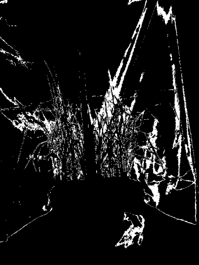 |

&nbsp;&nbsp;&nbsp;Observa-se na coluna da direita (figuras 2 e 4) a incapacidade do algoritmo em distinguir o objeto de interesse do fundo, gerando ruído.

<br>

### 1.2 Versão 2.0 — remoção de fundo por IA
<small>Sem datas de lançamento e descontinuação.</small>

> Status: essa versão foi descartada por apresentar falhas no método de segmentação.

&nbsp;&nbsp;&nbsp;Na segunda tentativa, buscou-se contornar a limitação de cores utilizando modelos de *Deep Learning* pré-treinados para remoção de fundo. A hipótese era que uma IA generalista conseguiria distinguir a forma da planta independentemente da cor. Entretanto, a complexidade dos fundos das imagens e a estrutura fina das folhas resultaram em recortes imprecisos, onde partes vitais da planta eram removidas ou áreas do fundo eram mantidas.

| Figura 5                 | Figura 6                 |
|--------------------------|--------------------------|
| 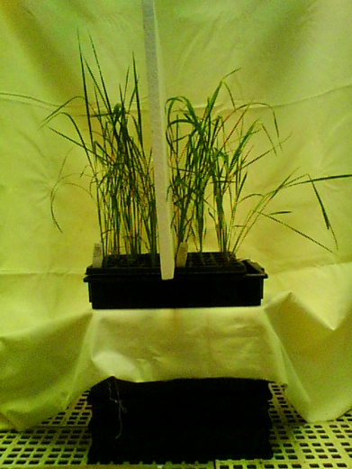 |  |

&nbsp;&nbsp;&nbsp;A eficácia da segmentação baseada em *Deep Learning* foi avaliada nas figuras 5 e 6. Como observado na máscara resultante, o modelo falhou em detectar a planta.

&nbsp;&nbsp;&nbsp;O algoritmo priorizou o objeto com maior densidade visual e bordas definidas: o recipiente, classificando a folhagem fina e irregular como parte do fundo. Isso ocorre, porque modelos assim são treinados para identificar objetos macroscópicos e sólidos, perdendo a sensibilidade necessária para segmentar estruturas orgânicas complexas como caules e folhas finas.

<br>

### 1.3 Versão 3.0 — mapeamento HSV e recorte automático
<small>Data de lançamento: 16/01/2026 | Data de descontinuação: 09/02/2026</small>
> Status: essa foi a primeira versão disponibilizada para uso, mas foi descontinuada devido a inconsistências matemáticas.

&nbsp;&nbsp;&nbsp;Após as limitações encontradas nas tentativas de segmentação espacial e por inteligência artificial, a estratégia de desenvolvimento se redirecionou para a análise das propriedades das cores das imagens térmicas. A hipótese central se fundamentava na premissa de que o canal *hue*, do espaço de cor HSV, manteria uma correlação linear com a temperatura superficial, permitindo a extração de dados térmicos através da decodificação da cor.

&nbsp;&nbsp;&nbsp;Em primeiro lugar, decidiu-se realizar a conversão do espaço de cor padrão das imagens (RGB) para o sistema HSV. O que motivou essa escolha foi a estrutura dos dados, o sistema RGB mistura informação de cor e luminosidade em três canais que variam de forma não linear, o que dificulta associar um valor numérico à temperatura. Observe o comportamento dos canais RGB nas cores primárias:

$$
Azul: (R=0, G=0, B=255)\\
Verde: (R=0, G=255, B=0)\\
Vermelho: (R=255, G=0, B=0)
$$

&nbsp;&nbsp;&nbsp;Como se nota acima, não há um crescimento numérico único que acompanhe o aumento da temperatura. Já o sistema HSV foi desenhado para organizar as cores de forma sequencial, isolando a cor do brilho. Portanto, a ideia era de que ao percorrer o canal *hue* dos valores altos (azuis) para os baixos (vermelhos), seria obtida uma função linearmente proporcional à temperatura.

|                                                                                      Figura 7                                                                                      |
|:----------------------------------------------------------------------------------------------------------------------------------------------------------------------------------:|
|                                                                             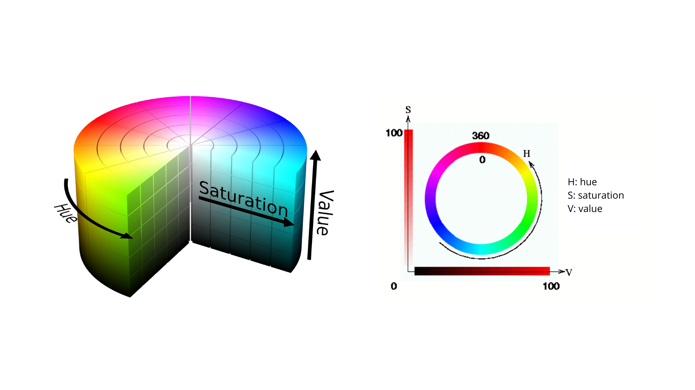                                                                             |
| <small><b>Sistema de cores HSV e canal *hue*.</b> A técnica implementada objetivava correlacionar a escala de temperatura apenas com H (a matiz no sistema de cores HSV). </small> |

&nbsp;&nbsp;&nbsp;Contudo, a validação dessa técnica revelou uma falha na premissa inicial. Ao tentar aplicar a conversão, identificou-se a impossibilidade de utilizar a barra de cores lateral da imagem FLIR como uma régua matemática precisa. Percebeu-se que, embora a figura 8 sugira uma escala contínua, essas gradações são representações artísticas projetadas para maximizar o contraste visual para o olho humano, não mantendo precisão linear nos dados [1], [2]. A conversão para HSV apenas traduziu essa distorção, sem corrigi-la.

|                                                                                            Figura 8                                                                                            |
|:----------------------------------------------------------------------------------------------------------------------------------------------------------------------------------------------:|
|                                                                                   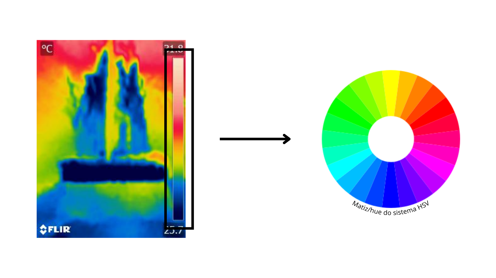                                                                                   |
| <small><b>Imagem térmica e canal *hue*.</b> A barra lateral apresenta uma escala visual não linear, o que exigiu a tentativa de conversão para um sistema numérico padronizado (HSV). </small> |

&nbsp;&nbsp;&nbsp;Apesar da lógica do HSV ser superior à do RGB, o projeto esbarrou em um obstáculo adicional: a natureza cíclica da matiz. Enquanto a temperatura é uma grandeza escalar linear ($T \in \mathbb{R}$), a matiz (*hue*) é uma grandeza angular cíclica ($H \in [0, 360^{\circ}]$).

&nbsp;&nbsp;&nbsp;No algoritmo de conversão padrão, o vermelho é definido como o ponto de origem ($0^{\circ}$), mas também representa o fechamento do ciclo ($360^{\circ}$). Isso cria uma descontinuidade matemática. Na paleta térmica das imagens disponibilizadas, as áreas de calor máximo variam do vermelho para o rosa claro. No espaço HSV, isso significa que um pixel vermelho puro vale 0, enquanto um pixel vizinho levemente rosa vale em torno de 300. Numericamente, a distância é enorme, fazendo o algoritmo interpretar temperaturas quase idênticas como extremos opostos.


&nbsp;&nbsp;&nbsp;A validação experimental abaixo (figuras 9 a 11) comprova a falha do método. Embora a conversão de espaço de cores tenha sido tecnicamente bem-sucedida, já que o tradutor funcionou, a não linearidade herdada da imagem original somada ao caráter cíclico do HSV gerou dados de temperatura incoerentes.

|                                             Figura 9                                              |
|:-------------------------------------------------------------------------------------------------:|
|                                     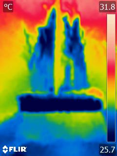                                      |
| <small><b>Imagem térmica original.</b> Note as áreas vermelhas no topo, indicando calor. </small> |

|                                                                 Figura 10                                                                  |
|:------------------------------------------------------------------------------------------------------------------------------------------:|
|                                                          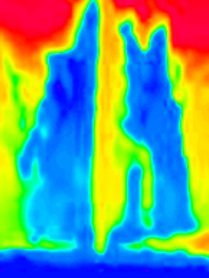                                                          |
| <small><b>Imagem recortada e convertida para *hue*.</b> A conversão isolou as cores, mas manteve as distorções da escala original.</small> |


|                                                                                                            Figura 11                                                                                                            |
|:-------------------------------------------------------------------------------------------------------------------------------------------------------------------------------------------------------------------------------:|
|                                                                                                    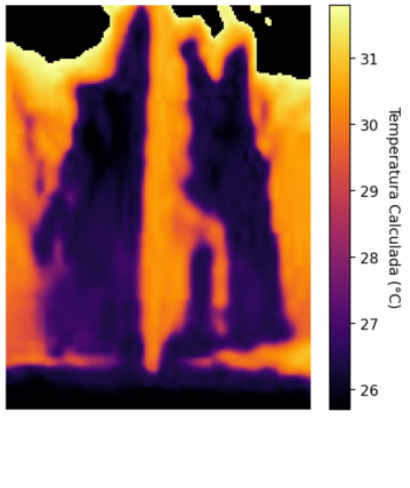                                                                                                    |
| <small><b>Resultado da conversão para temperatura.</b> Devido ao fato do sistema HSV ser cíclico, a região superior, que deveria ser quente, foi interpretada matematicamente como fria, evidenciando o erro do modelo.</small> |

&nbsp;&nbsp;&nbsp;Além da validação visual, a análise técnica dos metadados da imagem forneceu as evidências finais da inviabilidade do método. A tabela 1 destaca os parâmetros críticos extraídos do arquivo, confirmando dois fatores de corrupção dos dados [3] (leia as informações em destaque da coluna "Interpretação técnica").

<div style="text-align: center; font-weight: 800">Tabela 1: Metadados críticos extraídos da imagem térmica (figura 9)</div>

| Tag EXIF | Valor extraído | Interpretação técnica |
|---|---|---|
| Make / Model | FLIR Systems AB / FLIR C2 | Identificação do hardware (sensor Lepton 80×60) |
| Software | Flir Cronos | Firmware de processamento interno |
| ColorSpace | sRGB (1) | <span style="color:red">Prova de não linearidade: aplicação de curva gama para display</span> |
| ExifImageWidth | 240 pixels | <span style="color:red">Prova de interpolação: imagem é 16× maior que o sensor nativo</span> |
| ExifImageLength | 320 pixels | <span style="color:red">Prova de interpolação: imagem é 16× maior que o sensor nativo</span> |
| ComponentsConfig | YCbCr | Compressão com perda de dados de cor (subamostragem) |
| MakerNote | [Dados binários...] | Contém parâmetros de calibração proprietários não acessíveis via HSV |

&nbsp;&nbsp;&nbsp;Paralelamente à análise de cores, buscou-se mitigar os problemas de recorte das versões anteriores através de uma abordagem de segmentação mesclada. O processo consistia em uma delimitação manual preliminar da região de interesse pelo usuário, seguida de um algoritmo de recorte automático interno projetado para refinar a seleção da folhagem. Entretanto, a etapa de automação também se mostrou ineficiente. A baixa definição das bordas na imagem interpolada impediu que o algoritmo distinguisse com precisão os limites entre a folha e o fundo. Dessa forma, somando-se a instabilidade da segmentação à invalidade dos dados térmicos via HSV, a versão foi integralmente descartada, mantendo-se para a etapa seguinte apenas a técnica de segmentação manual.

|         Figura 12         |
|:-------------------------:|
| 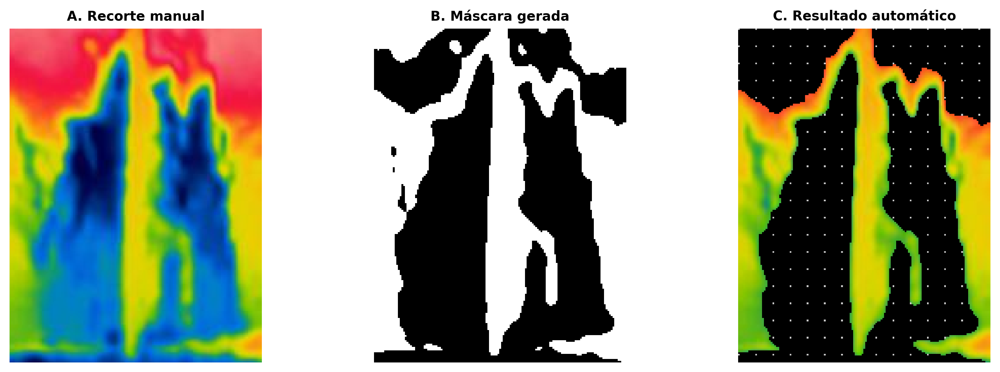 |
| <small><b>Demonstração da falha na segmentação automática mesclada.</b> (A) O recorte manual preliminar define a região de interesse. (B) A máscara binária gerada pelo algoritmo automático falha em delimitar o objeto devido às bordas difusas da imagem térmica interpolada. (C) O resultado final apresenta recorte impreciso, incluindo áreas do fundo e/ou excluindo partes da folhagem, comprovando a inviabilidade da automação nesta resolução.</small> |

---

## 2 Versão atual: extração de dados radiométricos
<small>Data de lançamento: 09/02/2026</small>

> Status: em produção e validação.

&nbsp;&nbsp;&nbsp;Após a anulação das abordagens baseadas em processamento de imagem visual (RGB/HSV), a estratégia técnica sofreu uma alteração fundamental de modelo. Concluiu-se, através das análises anteriores, que a informação visual é uma representação artística comprimida e complexa de ser decodificada. A informação científica real reside nos metadados brutos embutidos no arquivo pela câmera térmica. Portanto, essa versão foi desenvolvida para ignorar a representação visual das cores e acessar diretamente a matriz de sensores, o que aumenta muito a confiabilidade dos resultados.

### 2.1 Entendendo a câmera

&nbsp;&nbsp;&nbsp;Para compreender a eficácia da abordagem radiométrica em comparação com a análise de cores, é necessário entender como a imagem é gerada internamente. Segundo a documentação técnica da biblioteca *Flirpy* [4], diferentemente de uma foto comum, as imagens térmicas radiométricas contêm valores absolutos de medição. Isso ocorre porque os sensores de imagem térmica operam como uma matriz bidimensional de resistores. O princípio físico baseia-se na alteração direta da resistência elétrica de cada pixel quando o material do sensor aquece ou esfria ao receber radiação infravermelha.

&nbsp;&nbsp;&nbsp;Ainda conforme a documentação, a câmera mensura essa variação de resistência em toda a área do sensor, por exemplo, passando uma corrente de referência através de cada pixel, e o resultado é imediatamente digitalizado por um conversor analógico digital (ADC). O produto desse processo é armazenado como uma imagem bruta. Portanto, ao acessar esses dados nessa versão, estamos trabalhando com a leitura digital direta da resistência elétrica do sensor, um valor linear e íntegro, evitando as distorções artísticas e a compressão não linear aplicadas nas camadas visuais utilizadas nas versões anteriores.

### 2.2 Lógica de execução

> Nota: Os códigos abaixo servem apenas para ilustrar o algoritmo utilizado. A visualização completa das linhas pode ser limitada pela formatação em PDF.

&nbsp;&nbsp;&nbsp;O software desenvolvido opera sob a arquitetura *Streamlit*. Abaixo descreve-se o fluxo de execução, desde a inicialização das bibliotecas até a geração dos relatórios finais.

<b> 2.2.1 Inicialização e carregamento de bibliotecas </b>
&nbsp;&nbsp;&nbsp;Ao iniciar, o sistema carrega as bibliotecas essenciais de manipulação de dados (*pandas*, *numpy*) e processamento de imagem (*cv2*, *PIL*). O ponto crítico nesta etapa é a importação da engine radiométrica. O código verifica a existência da biblioteca *flirimageextractor* [5], responsável por decodificar os metadados binários da FLIR.

```python
# Importação segura da engine radiométrica
try:
    from flirimageextractor import FlirImageExtractor
except ImportError:
    st.error("Biblioteca 'flirimageextractor' não encontrada.")
```

<b> 2.2.2 Carregamento e organização de arquivos </b>

&nbsp;&nbsp;&nbsp;Quando o usuário realiza o upload dos arquivos, o sistema aciona a função `organizar_pares`. Diferente de uma leitura simples, esta função executa um analisador sintático nos nomes dos arquivos para:

- Identificar e separar imagens visuais de imagens térmicas.

- Extrair metadados experimentais (planta, tratamento, período) diretamente da nomenclatura do arquivo.

- Agrupar os arquivos correspondentes em um dicionário único, garantindo que a imagem térmica seja processada com seus metadados corretos.

```python
# Lógica de agrupamento e extração de metadados do nome do arquivo (não são os metadados da imagem)
if id_comum not in pares:
    pares[id_comum] = {'id': id_comum, 'visual': None, 'thermal': None, 'meta': None}
    
# Extração automática de metadados
if len(partes) >= 5:
    pares[id_comum]['meta'] = {
        'Planta': partes[0], 'Ambiente': partes[1], ...
    }
```

<b> 2.2.3 Interface de recorte </b>

&nbsp;&nbsp;&nbsp;O núcleo da interação ocorre na aba "Editor de recorte". O sistema itera sobre a lista de pares organizados, exibindo um por vez. Utiliza-se o componente `st_cropper` para permitir que o usuário desenhe a região de interesse sobre a imagem térmica exibida.

> Nota: O `st_cropper` retorna apenas a imagem recortada (pixels visuais), não as coordenadas. Isso exige um passo complexo na etapa seguinte.

```python
# Interface de recorte manual
img_crop = st_cropper(img_therm_full, realtime_update=True, box_color='#FF0000', ...)
```

<b> 2.2.4 Processamento da imagem térmica </b>
&nbsp;&nbsp;&nbsp;Ao clicar em "Confirmar", o sistema executa a função mais complexa do código. Ela converte o recorte visual em dados de temperatura. Este processo ocorre em 4 subetapas:

<small>

<b>2.2.4.1 Extração da matriz bruta</b>
&nbsp;&nbsp;&nbsp;O arquivo JPG original é salvo temporariamente e lido pelo extrator, que ignora a imagem visual e acessa o sensor térmico, retornando uma matriz com valores de ponto flutuante ($^{\circ}C$).

> Nota: na programação, os valores de ponto flutuante (*float type*) representam números com casas decimais.

```python
# Extração da matriz de temperatura (Celsius) dos metadados
flir = FlirImageExtractor(is_debug=False)
flir.process_image(tmp_path)
matriz_termica = flir.get_thermal_np() # Retorna array numpy com temperaturas reais
```

<b>2.2.4.2 Sincronização espacial</b>
&nbsp;&nbsp;&nbsp;Como descoberto na análise minuciosa da versão 3, a matriz térmica real (ex: 80x60) é muito menor que a imagem exibida na tela (320x240 interpolada). Para que o recorte do usuário coincida com os dados, a matriz térmica bruta é redimensionada para corresponder às dimensões da imagem visual.

```python
# Redimensiona a matriz de dados para bater com a imagem visual
matriz_termica = cv2.resize(matriz_termica, (w_vis, h_vis), interpolation=cv2.INTER_CUBIC)
```

<b>2.2.4.3 Localização de recorte</b>
&nbsp;&nbsp;&nbsp;O sistema utiliza o algoritmo de *template matching* [6] (correspondência de modelo, em português) para descobrir onde exatamente, na imagem original, o usuário fez o recorte. Ele procura a imagem recortada dentro da imagem original para obter as coordenadas $(x, y)$.

```python
# Encontra onde o usuário recortou usando correlação de imagem
res = cv2.matchTemplate(full_gray, crop_gray, cv2.TM_CCOEFF_NORMED)
_, _, _, max_loc = cv2.minMaxLoc(res)
x, y = max_loc # Coordenadas reais do recorte
```

<b>2.2.4.4 Extração estatística</b>
&nbsp;&nbsp;&nbsp;Com as coordenadas exatas, o sistema fatia a matriz de temperaturas (não a imagem de cores). A partir desse subconjunto de dados puros, calculam-se as estatísticas descritivas.

```python
# Recorte na matriz de dados (não na imagem)
termica_recortada = matriz_termica[y:y+h_crop, x:x+w_crop]

# Cálculo estatístico real
stats = {
    'Temp_Media': np.mean(pixels_validos),
    'Temp_Max': np.max(pixels_validos),
    ...
}
```

</small>

<b> 2.2.5 Visualização analítica </b>
&nbsp;&nbsp;&nbsp;Após o processamento de todas as imagens, os dados são consolidados em um *dataframe* do *pandas*. A aba "Dashboard" gera visualizações interativas. Uma funcionalidade nova desenvolvida nesta etapa foi a ferramenta de inspeção de pixels.

&nbsp;&nbsp;&nbsp;Para garantir que os pesquisadores possam validar visualmente os dados numéricos, utilizou-se a biblioteca *Plotly* para renderizar a matriz térmica bruta como um mapa de calor interativo. Diferente de uma imagem estática (PNG/JPG), este gráfico é gerado diretamente a partir do array *numpy* de ponto flutuante. A lógica de implementação define um modelo de interação que, ao detectar o cursor do mouse sobre uma célula $(x, y)$ da grade, exibe instantaneamente o valor $z$ (temperatura) correspondente, com precisão de duas casas decimais.

<b> 2.2.6 Exportação e relatório final </b>
&nbsp;&nbsp;&nbsp;Por fim, a função `gerar_pdf_final` une todas as evidências. Ela gera um documento PDF onde, para cada amostra, são apresentadas três visualizações lado a lado: a foto visual, o recorte térmico e o mapa de calor radiométrico gerado matematicamente, garantindo a rastreabilidade total do dado.

### 2.3 Validação da ferramenta
&nbsp;&nbsp;&nbsp;Para garantir a integridade dos dados extraídos e comprovar a superação das limitações das versões anteriores, desenvolveu-se uma rotina de validação passo a passo (`debug.py`). Esta ferramenta disseca o processo de execução do software, permitindo visualizar os dados intermediários em quatro etapas críticas.

> Nota: essa ferramenta foi criada apenas para provar os resultados obtidos, entre em contato com a desenvolvedora se quiser usá-la.

<b> 2.3.1 Provando a ingestão dos dados brutos </b>
&nbsp;&nbsp;&nbsp;A primeira validação confirma que o sistema está lendo dados físicos de temperatura e não valores de cor. Conforme observado na figura 13, o histograma dos dados extraídos (painel B) apresenta uma distribuição de valores contínuos de ponto flutuante (ex: $24.5^{\circ}C$ a $31.2^{\circ}C$). Isso contrasta com a natureza discreta de imagens digitais (inteiros de 0 a 255), comprovando que a biblioteca radiométrica acessou com sucesso o sensor térmico.

|Figura 13|
|:---:|
|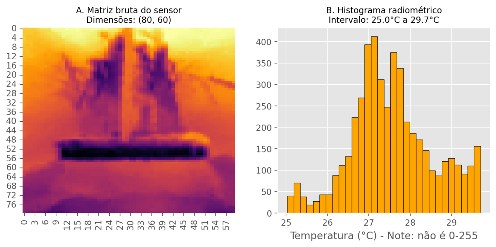|
|<small><b>Validação da ingestão de dados.</b> (A) Visualização da matriz térmica bruta ($80 \times 60$ pixels). (B) O histograma confirma que os dados são grandezas físicas de temperatura ($^{\circ}C$) com variação decimal, e não níveis de cinza.</small>|

<b> 2.3.2 Provando a sincronização espacial </b>
&nbsp;&nbsp;&nbsp;A inspeção revelou que o sensor nativo da câmera possui resolução de $80 \times 60$ pixels, enquanto a imagem visual de referência possui $320 \times 240$ pixels. Para permitir o recorte manual preciso, o sistema realiza uma reamostragem espacial da matriz térmica. A figura 14 demonstra o alinhamento dimensional, onde a matriz térmica (direita) é redimensionada para coincidir pixel a pixel com a imagem visual (esquerda), sem alterar os valores de temperatura.

|Figura 14|
|:---:|
|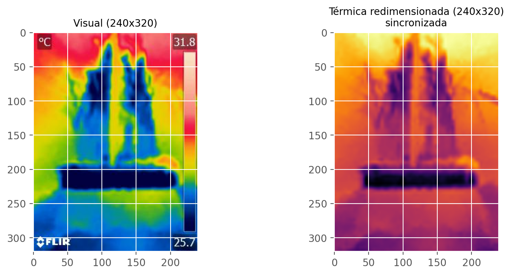|
|<small><b>Sincronização espacial.</b> Comparativo entre a imagem visual e a térmica após o redimensionamento. O processo adapta a matriz de $80 \times 60$ para $320 \times 240$, permitindo a sobreposição correta das camadas.</small>|

<b> 2.3.3 Provando a localização da região de interesse </b>

&nbsp;&nbsp;&nbsp;Uma vez que o recorte é desenhado na imagem visual (RGB), o algoritmo deve localizar a região correspondente na matriz térmica. A figura 15 ilustra o funcionamento do algoritmo de *template matching*. O retângulo vermelho indica a região de máxima correlação encontrada pelo *software*, garantindo que os pixels extraídos para cálculo estatístico correspondam geometricamente à área foliar selecionada pelo usuário.

| Figura 15 |
|:---:|
| 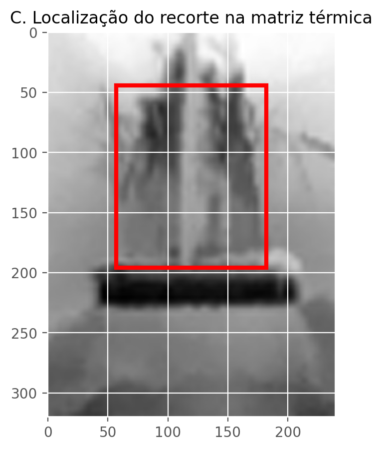 |
|<small><b>Geometria de extração.</b> O algoritmo varre a matriz térmica em busca do padrão visual recortado. O destaque em vermelho confirma que o software localizou corretamente as coordenadas $(x, y)$ da amostra na matriz de dados.</small>|

<b> 2.3.4 Provando a análise da matriz </b>
&nbsp;&nbsp;&nbsp;A prova definitiva da eficácia do método reside na inspeção individual dos pixels. A figura 16 apresenta uma visualização aumentada sobre os primeiros $10 \times 10$ pixels da região recortada. A visualização numérica comprova que cada célula da matriz possui um valor de temperatura único e independente (ex: um pixel a $24.8^{\circ}C$ adjacente a um de $25.1^{\circ}C$). Isso valida a sensibilidade do método para detectar sutis variações térmicas na superfície foliar, difíceis de serem registradas por métodos baseados em cor.

| Figura 16 |
|:---:|
| 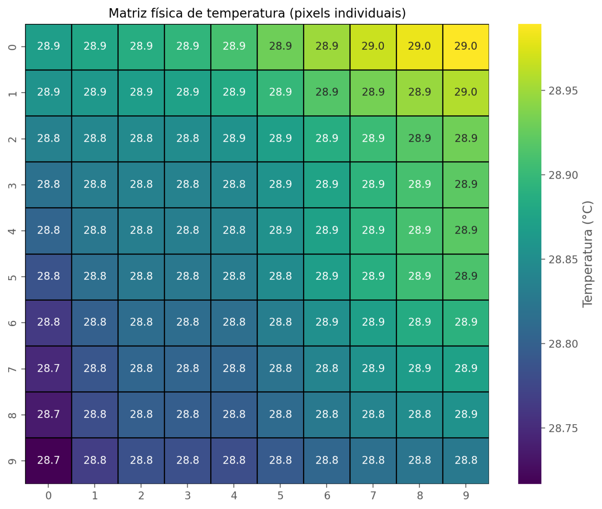 |
|<small><b>Micro-análise matricial.</b> Mapa de calor numérico de uma amostra de $10 \times 10$ pixels. A presença de valores decimais distintos em pixels adjacentes comprova a extração de dados físicos reais e a alta precisão do método final.</small>|

<b> 2.3.5 Validação externa </b>
&nbsp;&nbsp;&nbsp;Além da validação interna, o algoritmo foi submetido a um teste utilizando imagens de referência radiométricas padronizadas do modelo FLIR AX8 ([disponível no repositório oficial](https://github.com/nationaldronesau/FlirImageExtractor/blob/master/examples/ax8.jpg)). O software foi capaz de extrair as temperaturas equivalentes dos metadados da imagem de controle (com desvio desprezível de arredondamento decimal), confirmando que a leitura independe do hardware específico utilizado e que os cálculos estão calibrados com padrões da indústria. Compare as temperaturas definidas na imagem térmica com as obtidas:

| Figura 17 |
|:---:|
|  |
|<small><b>Imagem térmica.</b> Amostra de controle utilizada para teste de consistência dos dados brutos.</small>|

| Figura 18 |
|:---:|
| 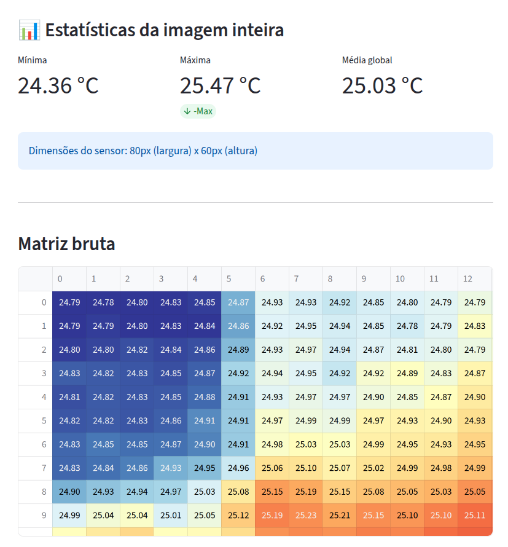 |
|<small><b>Validação numérica do algoritmo.</b> A coincidência entre os valores estatísticos extraídos pelo software e os parâmetros nativos da imagem de controle confirma a precisão na leitura da matriz de sensores.</small>|

> Comentário: 

---

## 3 Planejamento futuro
> Status: em desenvolvimento.

&nbsp;&nbsp;&nbsp;Objetivo: retomar a automatização de forma robusta e reproduzível.

- Estratégia proposta:
  1. Obter imagens com fundo mais contrastante.
  2. Gerar máscara a partir da imagem visual (RGB) usando *thresholding*.
  3. Sobrepor a máscara visual na matriz térmica para ler temperaturas apenas nos pixels classificados como planta.
  4. Validar a correspondência espacial entre visual e térmica.

---

## 4 Observações finais
- Evitar transformações de cor que quebrem a relação entre pixel e temperatura.
- Sempre preferir metadados quando disponíveis.
- Automatizações futuras devem incluir validação robusta de máscara e registro espacial entre imagens visual e térmica.

&nbsp;&nbsp;&nbsp;O código-fonte completo deste projeto, incluindo histórico de versões e ferramentas de validação, está hospedado publicamente no GitHub: github.com/brininha/thermal_plant_analysis

---

## 5 Bibliografia
[1] FLIR SYSTEMS. Image presentation modes: Linear vs. Histogram Equalization. FLIR Support Center Knowledge Base. Disponível em: https://www.flir.com/pt-br/support-center/instruments2/what-happens-when-i-select-histogram-equalization-as-the-image-presentation-in-flir-tools/. Acesso em: 01 fev. 2026.

[2] ROBERSON, Walter. Detect temperature from thermal image without converting it into gray scale. MATLAB Central Answers, 2021. Disponível em: https://www.mathworks.com/matlabcentral/answers/848290-i-need-to-detect-temperature-from-thermal-image-without-converting-it-into-gray-scale. Acesso em: 01 fev. 2026.

[3] HARVEY, Phil. ExifTool Tag Names: FLIR Tags. ExifTool Documentation, 2024. Disponível em: https://exiftool.org/TagNames/FLIR.html. Acesso em: 02 fev. 2026.

[4] FLIRPY DOCUMENTATION. Radiometry and Converting Raw Values. Read the Docs, 2023. Disponível em: https://flirpy.readthedocs.io/en/latest/getting_started/cameras.html#radiometry. Acesso em: 05 fev. 2026.

[5] BUDGIVER. FlirImageExtractor: Python tool for extracting thermal data. GitHub Repository. Disponível em: https://github.com/nationaldronesau/FlirImageExtractor. Acesso em: 02 fev. 2026.

[6] OPENCV TEAM. OpenCV: Template Matching. OpenCV Documentation. Disponível em: https://docs.opencv.org/4.x/d4/dc6/tutorial_py_template_matching.html. Acesso em: 02 fev. 2026.